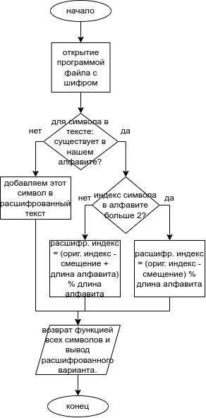
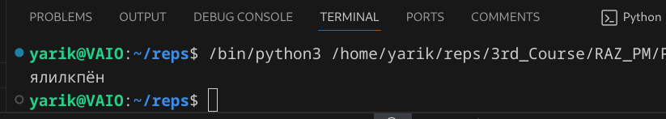
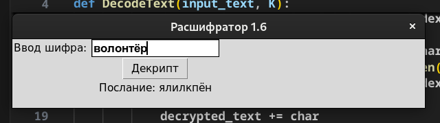
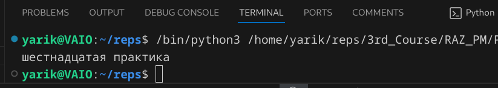
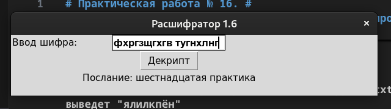
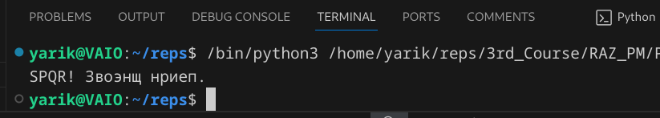
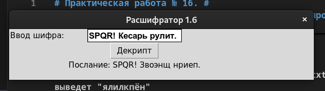

# Практическая работа № 16. #

### Тема: Формирование потока ввода-вывода ###

### Цель: совершенствование навыков составления программ на основе потоков ###

#### Ход работы ####

##### Задание: #####

> 11. Описать процедуру DecodeText(S, K), которая дешифрует текстовый файл с именем S, зашифрованный с использованием кодового смещения K (способ шифрования описан в задании 10). Используя эту процедуру и зная кодовое смещение K, расшифровать файл с указанным именем.

##### Контрольный пример: #####

> Записываю в файл (предварительно, в encrypted.txt) "волонтёр", программа выведет "ялилкпён"

> Записываю в файл "ыифхргзщгхгв тугнхлнг", программа выведет "шестнадцатая практика".

> Записываю в файл "SPQR! Кесарь рулит.", программа выведет "SPQR! Звоэнщ нриеп."

##### Системный анализ: #####

> Входные данные: char.

> Промежуточные данные: lc_alphabet, uc_alphabet, text, original_index, new_index, S, K, decrypted_text.

> Выходные данные: result.

##### Блок-схема: #####



##### Код терминальной программы: #####
```python
def DecodeText(S, K):
    lc_alphabet = 'абвгдежзийклмнопрстуфхцчшщъыьэюя'
    uc_alphabet = 'АБВГДЕЖЗИЙКЛМНОПРСТУФХЦЧШЩЪЫЬЭЮЯ'
    decrypted_text = ''

    with open(S, 'r', encoding='utf-8') as file:
        text = file.read()

    for char in text:
        if char in lc_alphabet:
            original_index = lc_alphabet.index(char)
            new_index = (original_index - K) % len(lc_alphabet)
            decrypted_text += lc_alphabet[new_index]
        elif char in uc_alphabet:
            original_index = uc_alphabet.index(char)
            new_index = (original_index - K) % len(uc_alphabet)
            decrypted_text += uc_alphabet[new_index]
        else:
            decrypted_text += char

    return decrypted_text

result = DecodeText('encrypted.txt', 3)
print(result)
```
##### Код оконной программы: #####
```python
import tkinter as tk
from tkinter import font

def DecodeText(input_text, K):
    lc_alphabet = 'абвгдежзийклмнопрстуфхцчшщъыьэюя'
    uc_alphabet = 'АБВГДЕЖЗИЙКЛМНОПРСТУФХЦЧШЩЪЫЬЭЮЯ'
    decrypted_text = ''
    
    for char in input_text:
        if char in lc_alphabet:
            original_index = lc_alphabet.index(char)
            new_index = (original_index - K) % len(lc_alphabet)
            decrypted_text += lc_alphabet[new_index]
        elif char in uc_alphabet:
            original_index = uc_alphabet.index(char)
            new_index = (original_index - K) % len(uc_alphabet)
            decrypted_text += uc_alphabet[new_index]
        else:
            decrypted_text += char

    return decrypted_text

def on_decrypt():
    input_text = e1.get()
    result = DecodeText(input_text, 3)
    output_label.config(text=f"Послание: {result}")

root = tk.Tk()
root.title("Расшифратор 1.6")
root.geometry("600x100")

label1 = tk.Label(root, text="Ввод шифра: ")
label1.grid(row=0, column=0)

semibold = font.Font(family="Arial", size=11, weight="bold")
e1 = tk.Entry(root, font=semibold)
e1.grid(row=0, column=1)

calc_button = tk.Button(root, text="Декрипт", command=on_decrypt)
calc_button.grid(row=1, column=1)

output_label = tk.Label(root, text="")
output_label.grid(row=2, column=1)

root.mainloop()
```
##### Результат работы программы: #####

* Ввод 1


* и окошко:


* Ввод 2


* и окошко:


* Ввод 3


* и окошко:


##### Вывод по проделанной работе: #####

> и почему букву ё недооценивают?