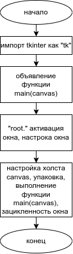
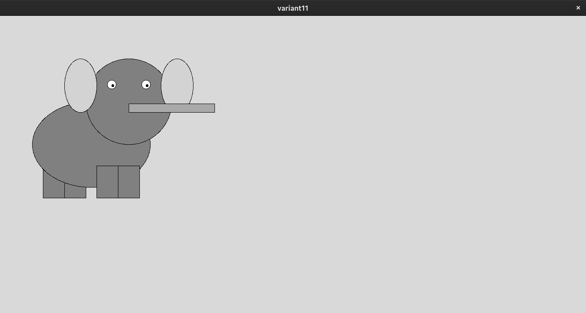

# Практическая работа № 17. #

### Тема: Составление программ с использованием графики ###

### Цель: совершенствование навыков составления программ на основе потоков ###

#### Ход работы ####

##### Задание: #####

> 11. Написать программу, которая вычерчивает на экране слона.

##### Контрольный пример: #####

> Чтобы увидеть рисунок, запускаю прогу.

##### Системный анализ: #####

> Входные данные: -

> Промежуточные данные: нет временных переменных

> Выходные данные: выполнение main(canvas)

##### Блок-схема: #####



##### Код оконной программы: #####
```python
import tkinter as tk

def main(canvas):
    #(левая, верхняя, правая, нижняя граница)
    #Ноги сзади
    canvas.create_rectangle(100, 350, 150, 425, fill='gray')
    canvas.create_rectangle(150, 350, 200, 425, fill='gray')
    # Тело
    canvas.create_oval(75, 200, 350, 400, fill='gray')
    # Ноги спереди
    canvas.create_rectangle(225, 350, 275, 425, fill='gray')
    canvas.create_rectangle(275, 350, 325, 425, fill='gray')
    # Голова
    canvas.create_oval(200, 100, 400, 300, fill='gray')
    # Уши
    canvas.create_oval(150, 100, 225, 225, fill='lightgray')
    canvas.create_oval(375, 100, 450, 225, fill='lightgray')
    # Глаза
    canvas.create_oval(250, 150, 270, 170, fill='white')
    canvas.create_oval(330, 150, 350, 170, fill='white')
    canvas.create_oval(260, 160, 265, 165, fill='black')
    canvas.create_oval(340, 160, 345, 165, fill='black')
    # Хобот
    canvas.create_rectangle(300, 225, 500, 205, fill='darkgray')

root = tk.Tk()
root.title("variant11")
root.geometry("1366x768")

canvas = tk.Canvas(root, width=1366, height=768)
canvas.pack()
main(canvas)
root.mainloop()
```
##### Результат работы программы: #####

* окошко:


##### Вывод по проделанной работе: #####

> turtle более интуитивен, тут как бы вставка фигур в прямоугольнике.