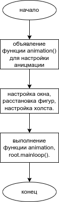
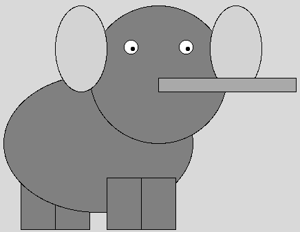
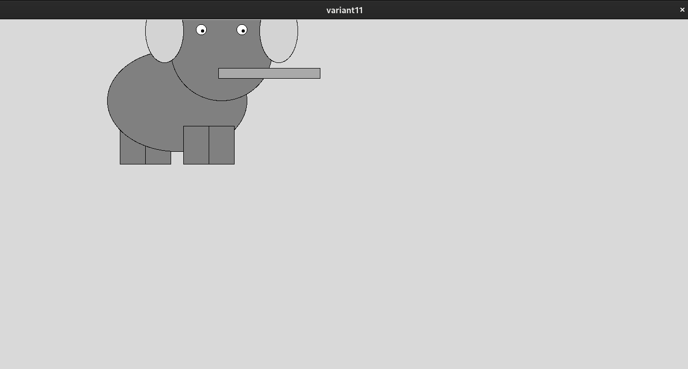
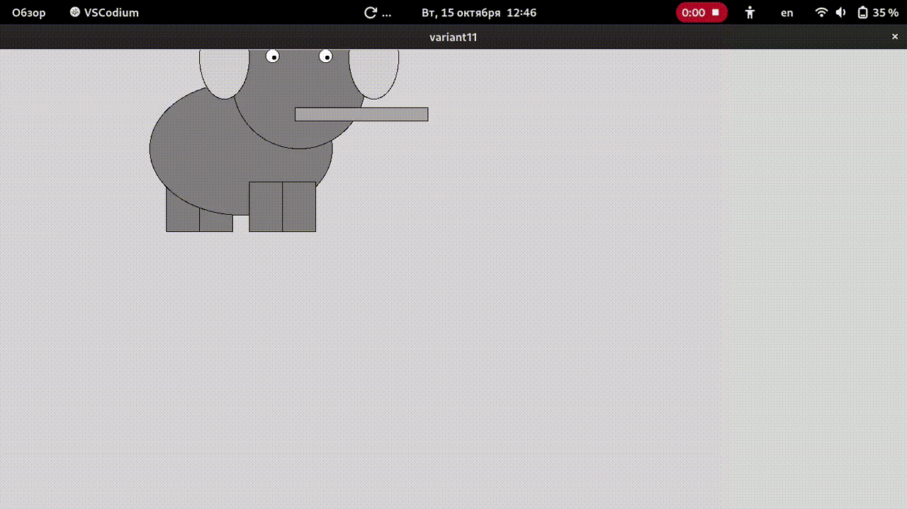

# Практическая работа № 18. #

### Тема: составление программ с использованием анимации ###

### Цель: совершенствование навыков составления программ на основе графики ###

#### Ход работы ####

##### Задачи: #####

> повторить структуру алгоритмов решения задач с графикой;

> повторить синтаксис операторов работы с графикой;

> приобрести навыки составления программ с графикой.

##### Контрольный пример: #####

> включаем, смотрим.

##### Системный анализ: #####

> Входные данные: - 

> Промежуточные данные: hobot, shapes[]

> Выходные данные: canvas.pack(), animation() и др. функции.

##### Блок-схема: #####



##### Код оконной программы: #####
```python
import tkinter as tk

def animation():
    for shape in shapes:
        canvas.move(shape, 5, -5)
        canvas.move(hobot, 0.4, 0.1)
    canvas.move(hobot, 0, -5.1)
    canvas.after(100, animation)

root = tk.Tk()
root.title("variant11")
root.geometry("1366x768")
canvas = tk.Canvas(root, width=1366, height=768)
canvas.pack()

shapes = []
#(левая, верхняя, правая, нижняя граница)
#Ноги сзади
shapes.append(canvas.create_rectangle(100, 350, 150, 425, fill='gray'))
shapes.append(canvas.create_rectangle(150, 350, 200, 425, fill='gray'))
# Тело
shapes.append(canvas.create_oval(75, 200, 350, 400, fill='gray'))
# Ноги спереди
shapes.append(canvas.create_rectangle(225, 350, 275, 425, fill='gray'))
shapes.append(canvas.create_rectangle(275, 350, 325, 425, fill='gray'))
# Голова
shapes.append(canvas.create_oval(200, 100, 400, 300, fill='gray'))
# Уши
shapes.append(canvas.create_oval(150, 100, 225, 225, fill='lightgray'))
shapes.append(canvas.create_oval(375, 100, 450, 225, fill='lightgray'))
# Глаза
shapes.append(canvas.create_oval(250, 150, 270, 170, fill='white'))
shapes.append(canvas.create_oval(330, 150, 350, 170, fill='white'))
shapes.append(canvas.create_oval(260, 160, 265, 165, fill='black'))
shapes.append(canvas.create_oval(340, 160, 345, 165, fill='black'))
# Хобот
hobot = (canvas.create_rectangle(300, 225, 500, 205, fill='darkgray'))

animation()
root.mainloop()
```
##### Результат работы программы: #####

* в одном месте:

* в другом (он чуть опускает хобот):

* GIF для большей наглядности (не успел вовремя включить запись)

##### Вывод по проделанной работе: #####

> вполне интуитивно, хоть и не очень функционально, тут даже можно поподбирать разные дробные циферки.