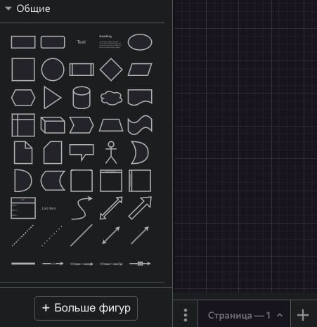
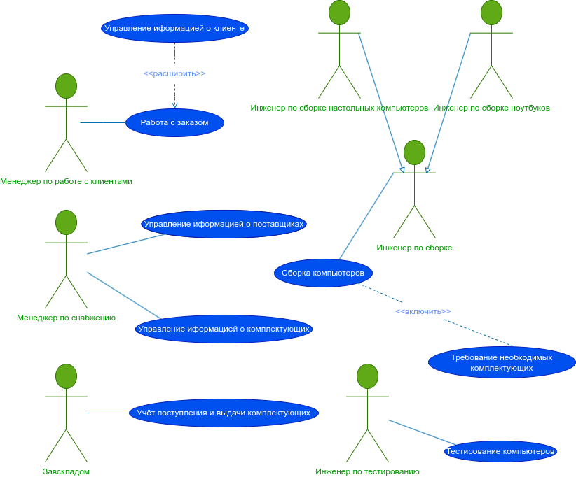
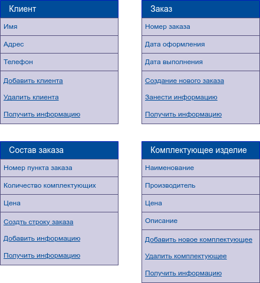
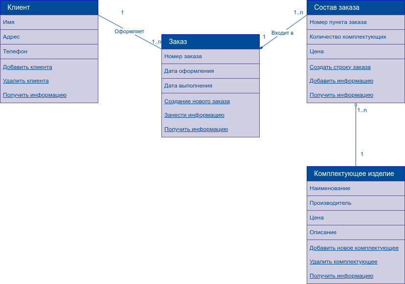
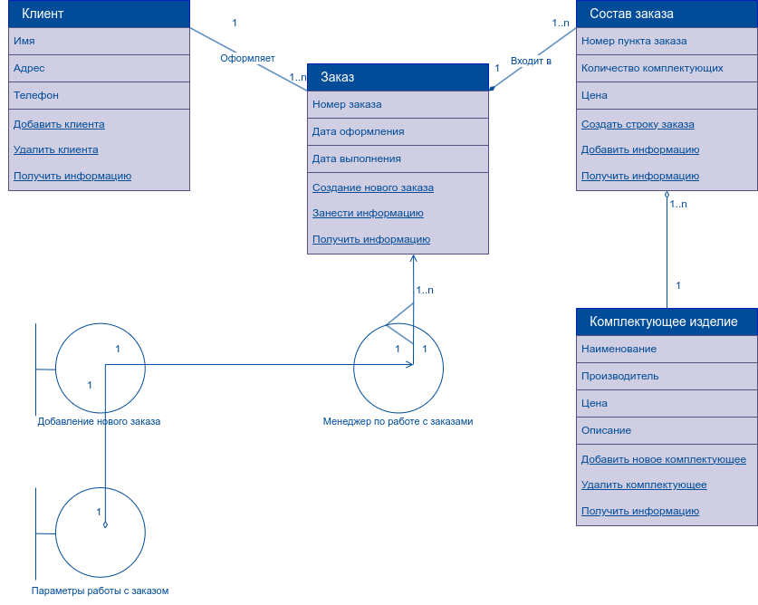

# Практическая работа № 3. #

Так как ПР состоит из мини-лабораторок с отдельными темами, целями и заданиями, эксклюзивно в этом Markdown-отчёте я поделил ПР на части.

##### Draw.io как свободный аналог Microsoft Visio! #####

* В Draw.io довольно много фигур, вот набор "Общие", некоторыми из них мы будем пользоваться дальше.

## Часть первая. ##

### Тема: Создание диаграммы вариантов использования (диаграммы прецедентов). ###

### Цель: ознакомиться и получить навыки построения диаграмм вариантов использования. ###

#### Ход работы ####

##### Задания: #####

> 1. Выделить действующих лиц и прецеденты.

> 2. Создать диаграмму вариантов использования, в которой будут заданы прецеденты и действующие лица.

> 3. Вставить отношения между вариантами использования и действующими лицами.

##### Рисуем в Draw.io № 1: #####

* Диграмма вариантов использования

## Часть вторая. ## 

### Тема: Создание диаграммы классов. ###

### Цель: получить навыки построения диаграмм классов. ###

#### Ход работы ####

##### Задание: #####

> Создать диаграмму классов для определённого прецедента из первой части, задав атрибуты и операции класса.

##### Рисуем в Draw.io № 2: #####

* Заполненные классы-сущности

* Также необходимо добавить отношения между классами-сущностями:

* И далее, дополним отношения "граничными классами":

##### Вывод по проделанной работе: #####

> Так как мы придерживаемся того же бизнес-плана что и в практиках по AFPM, до меня дошло лучше и мне будет легко повторить это для курсовика, например.