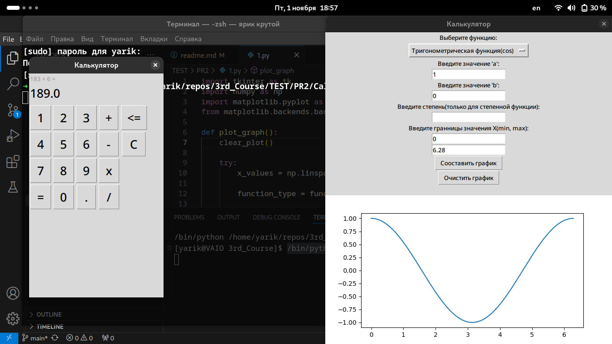

# Практическая работа № 2. #

### Тема: Тестирование "чёрным ящиком" ###

### Цель: изучить метод тестирования "чёрным ящиком" ###

#### Ход работы ####

##### Задания: #####

> 1. Написать калькулятор с небольшими багами. (В итоге взяли open-source калькуляторы на python).
>
Но грамотнее всё-таки начать с написания тестов, сначала за основу взяли калькулятор из Windows 7 с дополнением "Градусы"

> 2. Провести тестирование, составить отчёт.

##### Таблица тестов: #####

| Название теста         | Описание сценария                          | Входные данные                          | Выходные данные                | Успешность теста | Предложения по исправлению найденных ошибок | Пожелания пользователей          |
|------------------------|--------------------------------------------|----------------------------------------|--------------------------------|------------------|---------------------------------------------|----------------------------------|
| Тест линейной функции  | Проверка построения линейной функции      | a=2, b=3, x_min=0, x_max=10           | График линейной функции       | Успешно          | Убедиться в правильности ввода данных     | Добавить возможность сохранения графика |
| Тест квадратной функции| Проверка построения квадратной функции     | a=1, b=0, x_min=-10, x_max=10         | График квадратной функции     | Успешно          | Проверить обработку отрицательных значений | Возможность изменения цвета графика |
| Тест кубической функции |                                            |                                        |                                |                  |                                             |                                  |
| Тест степенной функции |                                            |                                        |                                |                  |                                             |                                  |
| Тест логарифмической функции |                                            |                                        |                                |                  |                                             |                                  |
| Тест показательной функции |                                            |                                        |                                |                  |                                             |                                  |
| Тест тригонометрической функции (sin) | Проверка построения синусоиды | a=1, b=0, x_min=0, x_max=6.28         | График синусоиды             | Успешно          | Добавить возможность выбора периода        | Добавить сетку на графике       |
| Тест тригонометрической функции (cos) | Проверим косинусоиду.                  |                               |                           |                  |                                             |                                                              |
| Usability-тест | Проверка функциональности кнопок | ввод/нажатие | должны были быть | Не успешно | Пофиксить кнопку "Очистить график" | Динамическое изменение графика, если менять цифры в текстбоксах. |
|                                       |                                        |                               |                           |                  |                                             |                                                              |


##### Дополнения: #####
```С

```
##### Результат работы программы: #####

* Ввод 1



##### Вывод по проделанной работе: #####

> 