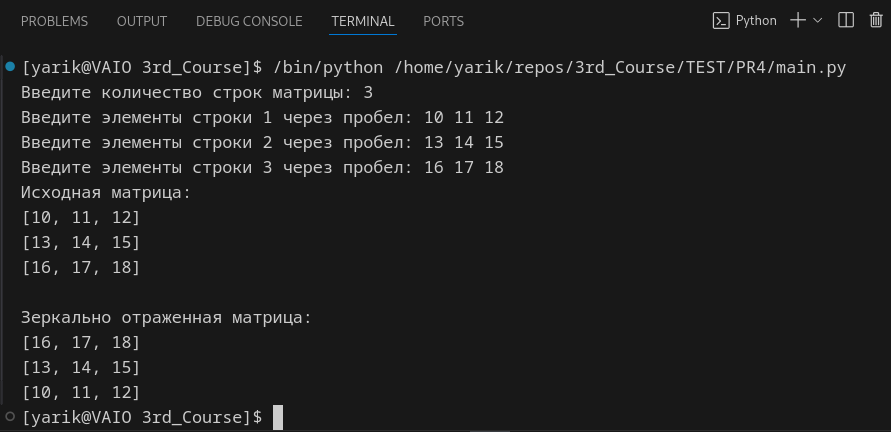
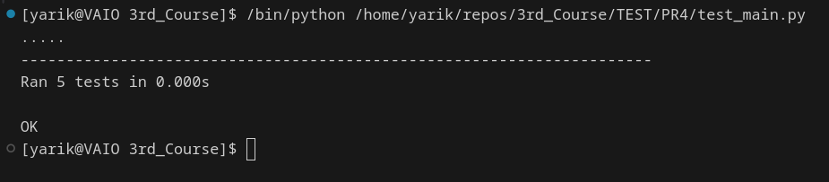

# Практическая работа № 4. #

### Тема: Модульное тестирование ###

### Цель: провести тестирование модульное и "Белым ящиком" ###

#### Ход работы ####

##### Задания: #####

> 1. Разработать программу (мой вариант - 11, выбрал "Matrix59")
>

> 2. Провести тестирование "Белым ящиком"
>

> 3. Провести модульное тестирование

##### Код консольной программы: #####
```python
def reflect_matrix(matrix):
    return matrix[::-1]

if __name__ == "__main__":
    
    rows = int(input("Введите количество строк матрицы: "))
    original_matrix = []

    for i in range(rows):
        row_input = input(f"Введите элементы строки {i + 1} через пробел: ")
        row = list(map(int, row_input.split()))
        original_matrix.append(row)

    reflected_matrix = reflect_matrix(original_matrix)
    
    print("Исходная матрица:")
    for row in original_matrix:
        print(row)
    
    print("\nЗеркально отраженная матрица:")
    for row in reflected_matrix:
        print(row)
```

##### Таблица тестов main.py: #####

| Название теста         | Описание сценария                          | Входные данные                          | Выходные данные                | Успешность теста |
|------------------------|-------------------------------------------|----------------------------------------|-------------------------------|------------------|
| Тест 1                 | Отражение матрицы 2x2                     | [[1, 2], [3, 4]]                       | [[3, 4], [1, 2]]              | Успешно          |
| Тест 2                 | Отражение матрицы 3x3                     | [[1, 2, 3], [4, 5, 6], [7, 8, 9]]     | [[7, 8, 9], [4, 5, 6], [1, 2, 3]] | Успешно          |
| Тест 3                 | Отражение пустой матрицы                  | [[]]                                   | [[]]                          | Успешно          |
| Тест 4                 | Отражение матрицы с одним элементом      | [[42]]                                 | [[42]]                        | Успешно          |
| Тест 5                 | Отражение матрицы 1x3                     | [[1, 2, 3]]                            | [[1, 2, 3]]                   | Успешно          |

##### Модульный тест: #####
```python
import unittest

def reflect_matrix(matrix):
    return matrix[::-1]

class TestReflectMatrix(unittest.TestCase):

    def test_reflect_2x2(self):
        self.assertEqual(reflect_matrix([[1, 2], [3, 4]]), [[3, 4], [1, 2]])

    def test_reflect_3x3(self):
        self.assertEqual(reflect_matrix([[1, 2, 3], [4, 5, 6], [7, 8, 9]]), [[7, 8, 9], [4, 5, 6], [1, 2, 3]])

    def test_reflect_empty_matrix(self):
        self.assertEqual(reflect_matrix([[]]), [[]])

    def test_reflect_single_element_matrix(self):
        self.assertEqual(reflect_matrix([[42]]), [[42]])

    def test_reflect_1x3(self):
        self.assertEqual(reflect_matrix([[1, 2, 3]]), [[1, 2, 3]])

if __name__ == '__main__':
    unittest.main()
```

##### Результат работы консольной программы: #####

* Запускается без библиотек:



* И модуль теста тоже:



##### Вывод по проделанной работе: #####

> работка